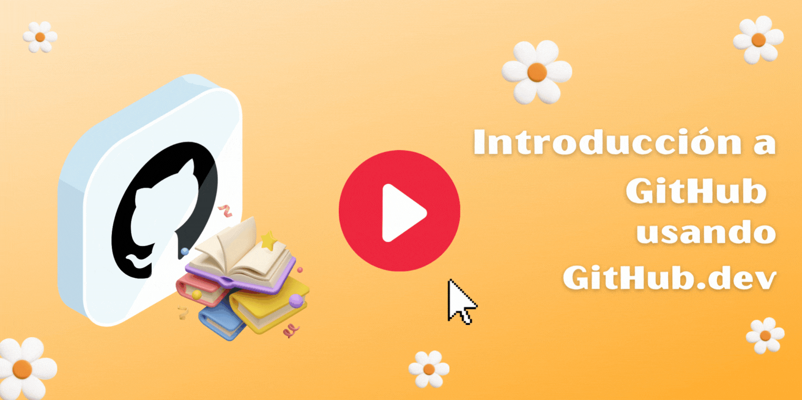

# Introducción a GitHub con GitHub.dev

Imagina que encuentras repositorio de Github increíble y sientes que podrías agregarle algunas partes que hagan falta. ¿Cómo harías esto? En este taller, aprenderás a:

- Abrir un repositorio mediante GitHub.dev
- Crear una rama
- Confirmar cambios en la rama
- Crear a pull request
- Fusionar el pull request
- Eliminar la rama

## Requisitos previos

1. Asegúrese de tener una [cuenta de GitHub](https://github.com) e inicie sesión.

1. Desplácese hasta el  [repositorio de la biblioteca del taller](https://github.com/microsoft/workshop-library).

1. Bifurca el repositorio dando clic sobre el botón **Fork** en la parte superior derecha de la página. Esto creara un nuevo repositorio en su cuenta para la practica.

- Lee [esta introducción a GitHub](https://docs.microsoft.com/learn/modules/introduction-to-github/1-introduction/?WT.mc_id=academic-55780-jelooper).

- Lee [esta explicación del flujo de trabajo de GitHub](https://docs.microsoft.com/learn/modules/introduction-to-github/2-what-is-github/?WT.mc_id=academic-55780-jelooper).

## Duración y presentación

El objetivo de este taller es que aprendas a usar Github.dev para administrar tareas básicas en GitHub, por lo cual, se tiene en cuenta los siguientes puntos: 

| **Objetivo**              | Descripción                                    |
| ----------------------------- | --------------------------------------------------------------------- |
| **Duración**                  | 20 minutos                                                                |
| **Diapositivas**                  | [Powerpoint](../../slides.pptx)                                                           |

## Video
> 🎥 Haz clic en esta imagen para ver a Jen dar un recorrido de este taller a partir de 0:04:15

## Recursos

Estos recursos los diseñamos para que tanto tú y tu audiencia puedan aprender un poco más sobre GitHub, Git y otros términos que se utilizan en este taller. ¡Siéntete libre de utilizar cualquiera de estos recursos que están a tu disposición en tus charlas o en redes sociales!

- [Memoramas](./recursos/memoramas.pdf)
Con la ayuda de este memorama podrás aprender y entender algunos conceptos basicos de manera más grafica.

- [Glosario](./recursos/glosario.pdf)
En este archivo podrás encontrar los términos más utilizados en este taller y comandos más utilizados en cualquier otro proyecto.

## Ejercicio
Pondras en practica todo lo que aprendiste en las lecciones pasadas.

<!--Paso 1 -->

 
  Paso 1: Abre el repositorio bifurcado en GitHub.dev

Desplázate hasta la copia del repositorio del taller de su cuenta. 

Escriba `.` en la ventana del navegador para abrirlo en GitHub.dev.

> GitHub.dev es una versión web de GitHub

<!--Paso 2 -->

 
 Paso 2: Crea una rama 

En GitHub.dev, da clic en el ícono ‘Control de código fuente’ en el panel izquierdo y luego el `...` en la esquina superior derecha del panel de archivos.

Crea una nueva rama seleccionando Rama > Crear nueva rama.

Dale un nombre a la rama y cambia a esta rama.

<!--Paso 3 -->

 
 Paso 3: Confirma los cambios

Haz un pequeño cambio en el archivo `taller-sugerencias.md` – ¿qué taller le gustaría ver en esta biblioteca?

Suba los cambios a su rama agregando un mensaje significativo al cuadro de texto del panel de origen y haciendo clic en el botón 'comprobar'.

> El código de 'Pushing' significa que agregará los cambios a una copia bifurcada del repositorio.

El cambio aparece ahora en la copia del repositorio

<!--Paso 4 -->

 
  Paso 4: Crea un pull request

> Lee acerca de las [mejores prácticas](https://docs.microsoft.com/learn/modules/contribute-open-source/4-exercise-create-pr/?WT.mc_id=academic-55780-jelooper) para crear una solicitud de extracción.

Ahora necesita mover los cambios de su rama a la rama principal.

En el panel izquierdo, haga clic en el ícono 'control de código fuente'  y a continuación, en el botón '...'.

Selecciona 'Pull request>Crear Pull Request' desde el menú desplegable o utilice el ícono Pull request en el panel de archivos.

Fusione el cambio de la rama en la rama principal de su repositorio.

<!--Paso 5 -->

 
  Paso 5: Fusione el pull request y elimine la rama

Compruebe que la bifurcación no tiene conflictos con la bifurcación base y fusiona la solicitud de extracción creando una confirmación de combinación.

En la última pantalla, siga las instrucciones para eliminar la rama remota en la que realizó los cambios.

> ¿Qué sucedió? El pequeño cambio que realizó en su rama fue copiado en la rama principal de su repositorio. Puede utilizar está técnica para contribuir a un proyecto de código abierto que acepte pull requests. Revisa la pestaña de issues de este repositorio para ver si hay algo que este marcado como abierto para contribuir.

  

## ¡Prueba tus conocimientos!

En un modulo de Microsoft Learn, haras una pequeño examen que pondra a prueba los conocimientos que aprendiste en este taller, [haz clic aqui.](https://docs.microsoft.com/learn/modules/introduction-to-github/4-knowledge-check/?WT.mc_id=academic-55780-jelooper)

## Siguientes pasos

Si quieres sugerir el pull request en el repositorio original que hiciste fork, repite el proceso anterior.

[Lea más sobre como ampliar sus conocimientos de GitHub y sus flujos de trabajo](https://docs.microsoft.com/learn/modules/contribute-open-source/5-next-steps/?WT.mc_id=academic-55780-jelooper).

## Práctica

Ahora sabe como crear ramas y hacer pull requests, encuentra un repositorio de código abierto que busque contribuciones. ¿Hay alguna forma de que usted pueda contribuir a este proyecto?

## Agradecimientos 💖

¡Muchisimas gracias a [Daniela Morales](https://www.linkedin.com/in/daniela-morales-sixto) @DaniMSix por habernos ayudado a traducir este contenido a Español!

¡Muchisimas gracias a [Julia Muiruri](https://developer.microsoft.com/en-us/advocates/julia-muiruri) por haber realizado las ilustraciones del [memorama](./recursos/memoramas.pdf) de este taller! 

## Retroalimentación

Asegurate de dar [retroalimentación a este taller](https://forms.office.com/r/MdhJWMZthR)!

## [Codigo de conducta](../../CODE_OF_CONDUCT.md)

## Módulo de referencia

[Introducción a Github](https://docs.microsoft.com/learn/modules/introduction-to-github/?WT.mc_id=academic-55780-jelooper)

